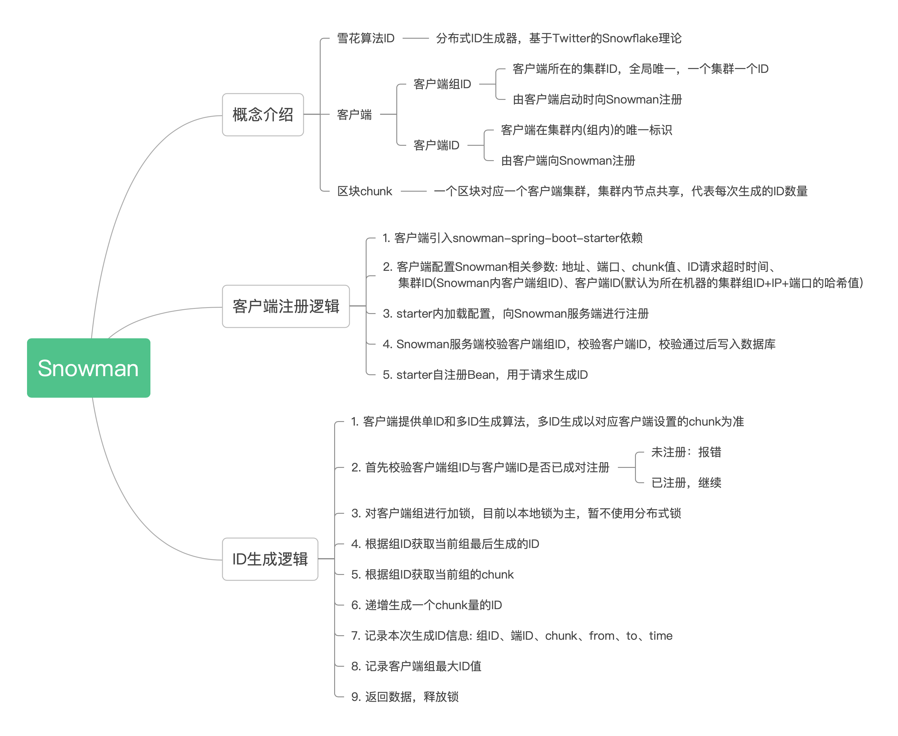

# snowman
snowflake

使用场景

- 业务需要根据一定的规则生成序号，如：
  - 连续性：序号连续自增地进行分配
  - 相关性：多租户隔离、按年、月、日分区
  - 格式化: 序号输出的格式灵活可控
- 技术上需要满足
  - 高性能
  - 线程安全
  - 适用性好
  - 配置简单、容易集成
  
  
## 项目说明

- ***JDK 版本要求: `JDK8+`*** 

- 支持的后端
  - MySQL
  - Redis
  - MongoDB

## 核心概念

## 使用方法

引入依赖

开启配置(JDBC)

使用

## 性能测试

## 效果演示

## 开发计划

 ## 贡献指南

 代码要求：
  - 统一风格，包含注释、代码缩进等与本项目保持一致
  - 保持代码整洁，比如注释掉的代码块等垃圾代码应该删除
  - 严格控制外部依赖，如果没有必要，请不要引入外部依赖
  - 请在类注释中保留你的作者信息，请不要害羞

